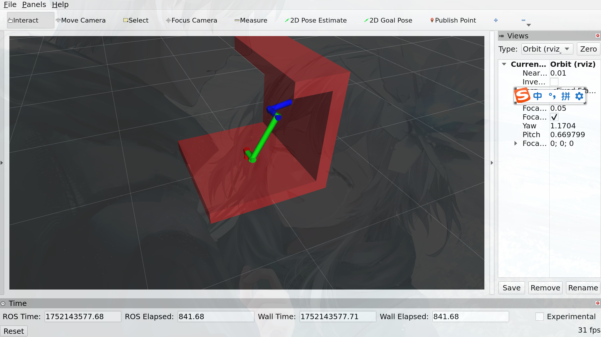
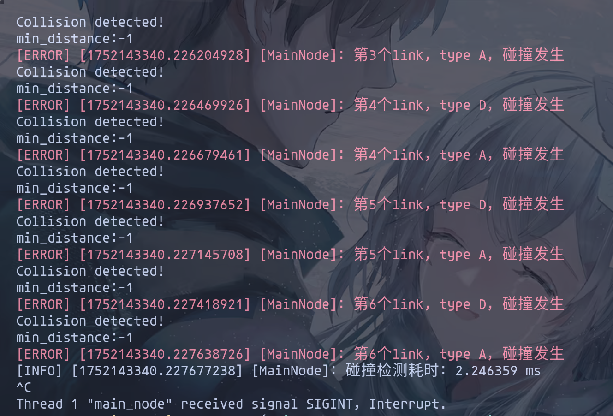

# ManipulatorCollisionDetector
简单的类ur3机械臂正运动学，可视化，障碍物碰撞检测。

采用ros2 humble的消息visualization_msgs::msg::Marker在rviz2中可视化。不涉及tf关系。

## 1. 安装

``` bash
git clone --recurse-submodules https://github.com/bingmaochen/ManipulatorCollisionDetector.git
```

主要依赖是FCL碰撞检测库，它需要libccd依赖。Eigen库，这个直接命令行安装即可。

按照对应github用cmake编译出来即可。`src/CMakeLists.txt`中这样找到对应的库文件。

```cmake
# 设置fcl依赖
set(CMAKE_FIND_USE_CMAKE_SYSTEM_PATH OFF)
set(FCL_INCLUDE_DIRS "${CMAKE_CURRENT_SOURCE_DIR}/dependencies/fcl/include")
set(FCL_LIBRARIES_DIRS "${CMAKE_CURRENT_SOURCE_DIR}/dependencies/fcl/build/lib")
set(LIBCCD_LIBRARIES_DIRS "${CMAKE_CURRENT_SOURCE_DIR}/dependencies/build/libccd/lib")
include_directories(${FCL_INCLUDE_DIRS})
link_directories(${FCL_LIBRARIES_DIRS})
link_directories(${LIBCCD_LIBRARIES_DIRS})

include_directories(include)
include_directories(${Eigen3_INCLUDE_DIRS})
add_executable(main_node src/main.cpp src/manipulator.cpp)
target_link_libraries(main_node "libccd.so" "libfcl.so")
```

## 2.使用

1. 编译节点

```bash
colcon build --symlink-install --cmake-args -DCMAKE_BUILD_TYPE=Debug --parallel-workers 8
```

2. gdb运行节点（方便调试）

```bash
source install/setup.sh
ros2 run --prefix "gdb" collison_visualize main_node
```

3. 打开rviz2，设置坐标系为`base_link`，添加对应可视化话题`visualization_marker_array`
4. 发布关节角度话题数据

```bash
ros2 topic pub /joint_states std_msgs/msg/Float64MultiArray "{data: [-180, 60, 50]}"
```

5. 结果如下：





6. 话题中只接受前3个关节的角度值，改变角度值可以改变rviz2中的位置，同时重新检测碰撞。
7. 修改障碍物stl模型可以在`main.cpp:51`

```c++
    std::string obs_stl_file_path =
        "/home/test/桌面/collison_detection/src/collison_visualize/stl/"
        "obs_m.STL";
```

## 3. 核心使用

主要分为正运动学和FCL的碰撞检测部分。在`main.cpp:132`

```c++
    // 正运动学解算
    manipulator_ptr_->ForwardKinematics(q_lst);

    // 更新visualizer
    for (int i = 1; i <= manipulator_ptr_->GetLinkNum(); i++) {
        auto T_i_0 = manipulator_ptr_->GetT(i, 0);
        auto T_pre_0 = manipulator_ptr_->GetT(i - 1, 0);
        visualizer_ptr_->Update(T_i_0, T_pre_0, i);
    }

    // 碰撞检测
    auto start = std::chrono::high_resolution_clock::now();
    for (int i = 1; i <= manipulator_ptr_->GetLinkNum(); i++) {
        // 基座和障碍物不用判断，因为可能固连
        if (i == 1)
            continue;
        auto T_i_0 = manipulator_ptr_->GetT(i, 0);
        auto T_pre_0 = manipulator_ptr_->GetT(i - 1, 0);
        if (collision_detector_ptr_->CheckCollision(
                T_pre_0, manipulator_ptr_->link_d_lst_[i - 1])) {
            RCLCPP_ERROR(this->get_logger(), "第%i个link, type D, 碰撞发生", i);
        }
        if (collision_detector_ptr_->CheckCollision(
                T_i_0, manipulator_ptr_->link_a_lst_[i - 1])) {
            RCLCPP_ERROR(this->get_logger(), "第%i个link, type A, 碰撞发生", i);
        }
    }
    auto end = std::chrono::high_resolution_clock::now();
    auto duration =
        std::chrono::duration_cast<std::chrono::nanoseconds>(end - start);
    RCLCPP_INFO(this->get_logger(), "碰撞检测耗时: %f ms",
                duration.count() / 1e6);
```

正运动学的核心在`Manipulator`类里，和其他类无关，无耦合。

碰撞检测的核心在`CollisionDetector`类里，只需要给出需要检测的link和对应的变化矩阵即可。

